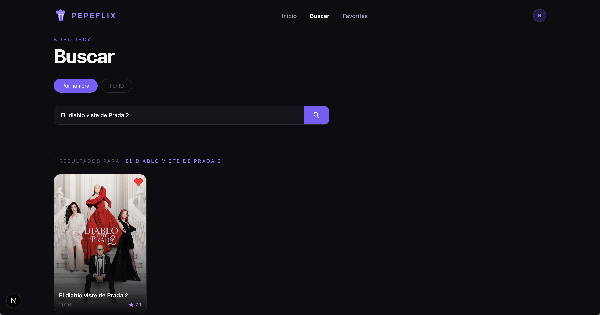
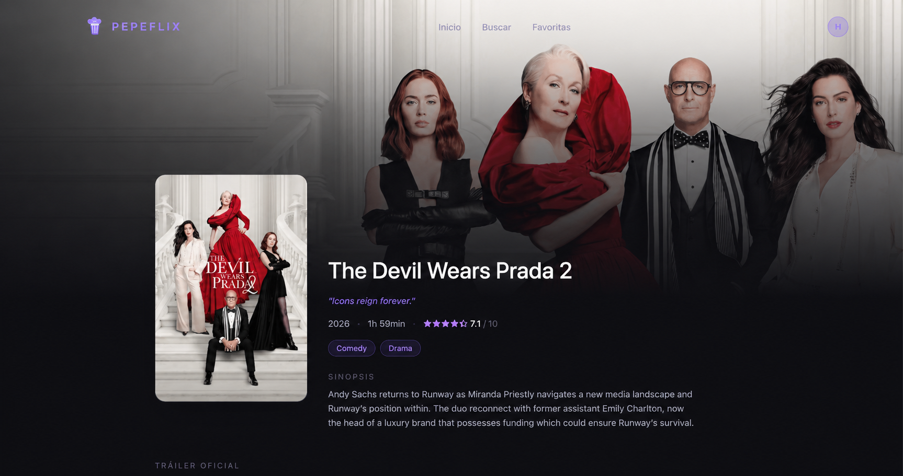
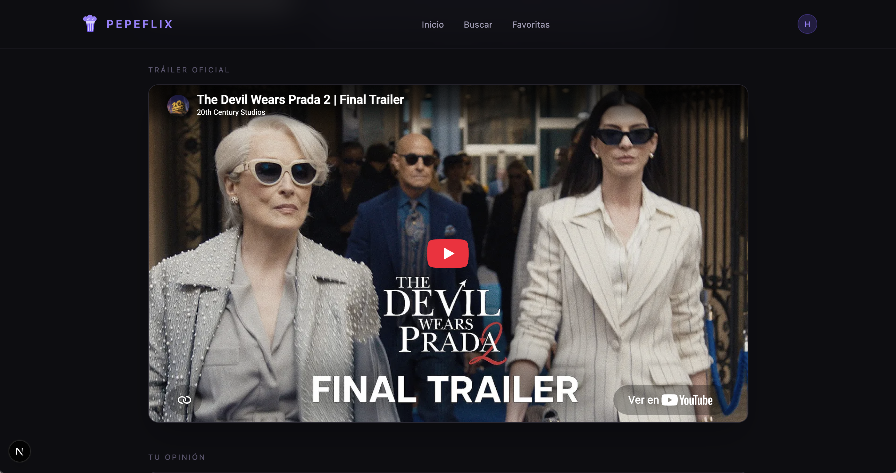
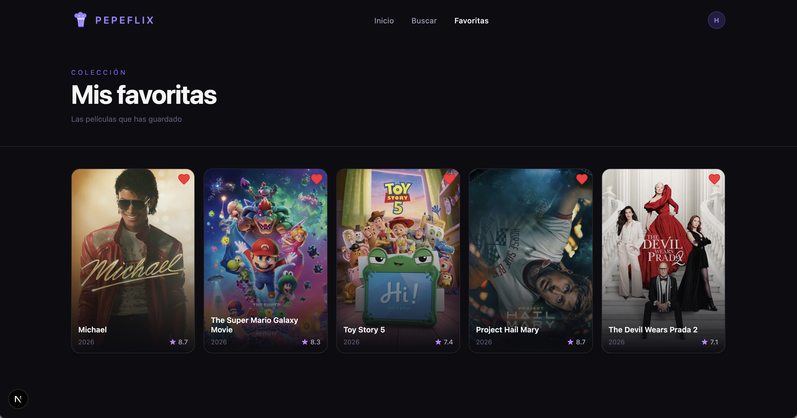
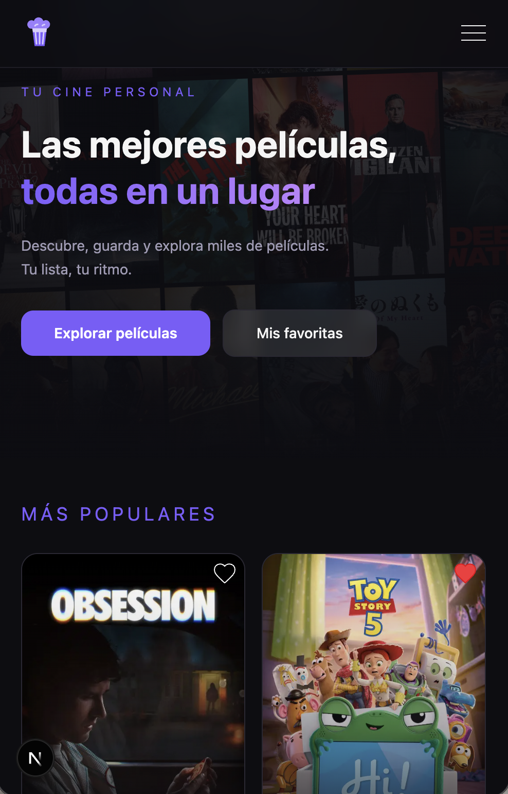

# 🎬 PEPEFLIX

Aplicación web para descubrir películas desarrollada con Next.js 16 y la API de TMDB, con una interfaz inspirada en las plataformas de streaming modernas.

Permite explorar las películas más populares, realizar búsquedas por nombre o ID, guardar películas favoritas y consultar información detallada junto con su tráiler.

> 💻 **Repositorio:** https://github.com/Hajarprog/Pepeflix


---


## Características

- Exploración de las películas más populares.
- Búsqueda de películas por nombre o ID de TMDB.
- Sistema de favoritas con persistencia en `localStorage`.
- Ficha detallada con sinopsis, puntuación, géneros y tráiler de YouTube.
- Sistema de comentarios por película con opciones para crear, editar y eliminar.
- Navegación mediante teclado y foco visible en los elementos interactivos.
- Diseño responsive para móvil, tablet y escritorio.
- Uso de Server Components para obtener los datos de TMDB en el servidor. 
- Gestión de errores, rutas inexistentes e IDs de películas no válidos.


---


## Tecnologías

| Tecnología | Uso |
|------------|-----|
| Next.js 16 | Framework principal (App Router) |
| React | Componentes y lógica de la interfaz |
| Tailwind CSS | Diseño y estilos responsive |
| Zustand | Estado global del estado de favoritas |
| TMDB API | Información, imágenes y vídeos de películas |
| API Routes | Gestión de los comentarios |
| ESLint | Calidad y consistencia del código |


---


## Primeros pasos

### 1. Clona el repositorio

```bash
git clone https://github.com/Hajarprog/Pepeflix.git
cd Pepeflix
```

### 2. Instala las dependencias

```bash
npm install
```

### 3. Configura la API de TMDB

Crea una cuenta en **The Movie Database (TMDB)** y obtén una API Key desde su página de configuración:

https://www.themoviedb.org/settings/api

Después, crea un archivo `.env.local` en la raíz del proyecto:

```env
API_KEY=tu_api_key
```

> También puedes utilizar el archivo `.env.example` incluido en el repositorio como referencia.

### 4. Inicia el proyecto

```bash
npm run dev
```

Abre la aplicación en el navegador en:

```
http://localhost:3000
```

---


## Arquitectura del proyecto

El proyecto utiliza **App Router de Next.js**, separando la obtención de datos en el servidor de las funcionalidades interactivas ejecutadas en el cliente.

- **Server Components** para obtener los datos desde TMDB en el servidor, reduciendo el JavaScript enviado al cliente.
- **Client Components** para las funcionalidades que requieren interacción, estado o acceso a las APIs del navegador.
- **Zustand** para gestionar el estado global de las películas favoritas.
- **Persistencia en `LocalStorage`** para conservar las favoritas entre sesiones.
- **Hidratación controlada con `skipHydration`** para evitar diferencias entre el renderizado del servidor y el estado almacenado en el navegador.
- **API Routes** para implementar las operaciones CRUD del sistema de comentarios y para obtener en lote los datos de las películas favoritas (`app/api/peliculas`).
- **`error.jsx` y `not-found.jsx`** para gestionar errores de la API, rutas inexistentes e IDs de películas no válidos.


---


## Estructura del proyecto

```text
pepeflix/
├── app/
│   ├── api/
│   │     ├── comentarios/route.js
│   │     └── peliculas/route.js
│   ├── buscar/page.jsx
│   ├── favoritas/page.jsx
│   ├── pelicula/[id]/page.jsx
│   ├── error.jsx
│   ├── not-found.jsx
│   ├── layout.jsx
│   └── page.jsx
│
├── components/
│   ├── BarraBusqueda.jsx
│   ├── CajaComentarios.jsx
│   ├── ContenedorPelis.jsx
│   ├── ContenedorPelisFavs.jsx
│   ├── FichaPeliculaComponente.jsx
│   ├── Footer.jsx
│   ├── HeroBanner.jsx
│   ├── HydrateFavoritas.jsx
│   ├── Like.jsx
│   ├── Navbar.jsx
│   └── TarjetaPeli.jsx
│
├── lib/
│   └── tmdbApi.js
│
├── data/
│   ├── comentarios.json
│   └── trailers.json
│
├── public/
│   ├── preview.png
│   ├── busqueda.png
│   ├── ficha.png
│   └── favoritas.png
│
└── store/
    └── useFavoritasStorage.js
```

---


## Imágenes de TMDB

Las imágenes de las películas se construyen utilizando la siguiente URL base:

```text
https://image.tmdb.org/t/p/TAMAÑO + poster_path
```

En el proyecto se utilizan principalmente los siguientes tamaños:

| Tamaño | Uso |
|---------|-----|
| `w342` | Posters del listado |
| `w500` | Poster de la ficha detallada|
| `original` | Imagen de fondo del Hero |

Puedes consultar más información en la documentación de imágenes de TMDB:

https://developer.themoviedb.org/docs/image-basics


---


## Sistema de tráilers

Cuando una película dispone de varios vídeos, la aplicación selecciona el contenido siguiendo este orden de prioridad:

1. Tráiler oficial disponible de TMDB.
2. Teaser disponible en TMDB.
3. Tráiler definido manualmente en `data/trailers.json`.

Ejemplo de tráiler manual:

```json
{
  "27205": "cdx31ak4KbQ"
}
```
La clave corresponde al ID de la película en TMDB y el valor al ID del vídeo de YouTube.


---


## Sistema de comentarios

Los comentarios se gestionan mediante una **API Route** que admite las siguientes operaciones:

- `GET` para obtener los comentarios.
- `POST` para crear un comentario.
- `PUT` para editar un comentario.
- `DELETE` para eliminar un comentario.

Los comentarios se almacenan en:
```
data/comentarios.json
```

Desde la ficha de cada película se pueden crear, editar y eliminar comentarios.
Antes de borrar un comentario, la aplicación solicita confirmación al usuario.

Actualmente, los comentarios se almacenan en un archivo JSON, por lo que esta solución está pensada únicamente para un entorno local o de desarrollo. En una aplicación en producción sería recomendable utilizar una base de datos o un servicio de almacenamiento persistente.


---


## Retos y decisiones técnicas

### Selección de tráiler

No todas las películas disponen de un tráiler oficial en TMDB. Para evitar que la ficha aparezca sin contenido audiovisual, se implementó un sistema de prioridad que busca primero un tráiler oficial, después un teaser y, como último recurso, un vídeo configurado manualmente.

### Server Components y Client Components

Otro de los retos fue separar correctamente la lógica ejecutada en el servidor de las funcionalidades que necesitan ejecutarse en el navegador.

Los datos de TMDB se obtienen mediante Server Components, mientras que las favoritas, los comentarios y otras interacciones se gestionan desde Client Components.

### Persistencia e hidratación de favoritas

El servidor no puede acceder a `localStorage`, por lo que el primer renderizado no conoce las películas guardadas como favoritas.

Para evitar parpadeos y diferencias entre el HTML generado en el servidor y el estado del cliente, se utilizó la opción `skipHydration` de Zustand y una hidratación controlada del store.

### Gestión de errores

Se añadieron páginas específicas mediante `error.jsx` y `not-found.jsx` para evitar que un fallo de la API de TMDB, una ruta inexistente o un ID no válido rompan la aplicación.

### Accesibilidad

Se trabajó la navegación mediante teclado, el foco visible y el uso de elementos interactivos accesibles para mejorar la experiencia de usuarios que no utilizan ratón.


--- 


## Capturas


### Descubrimiento de contenido


### Búsqueda inteligente





### Detalle de película





### Tráiler integrado





### Colección personal





### Experiencia en móvil





---


## Créditos

Los datos de películas son proporcionados por **The Movie Database (TMDB)**.

Este producto utiliza la API de TMDB, pero **no está respaldado ni certificado por TMDB**.


---


## Desarrollado por Hajar en 2026